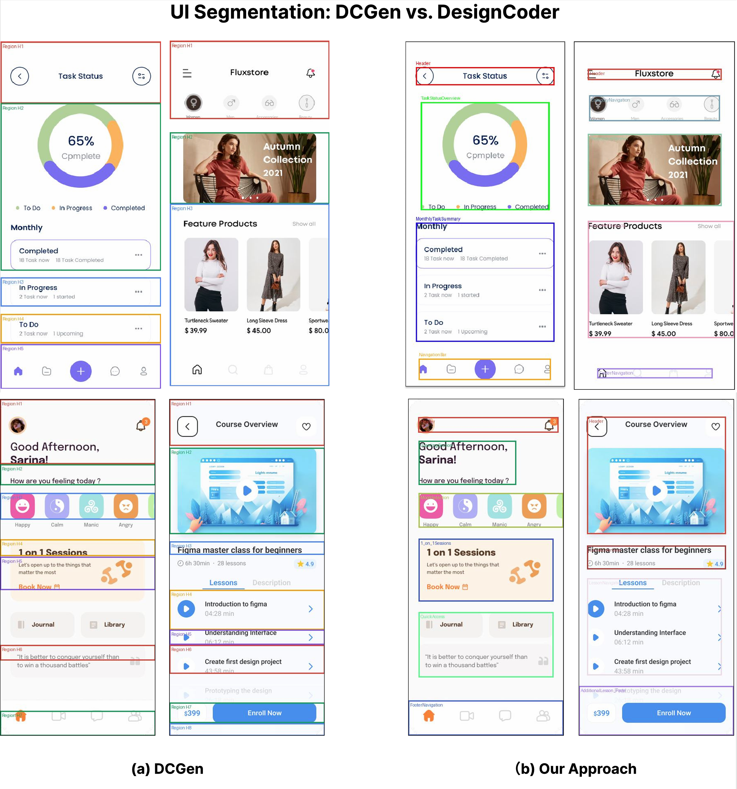
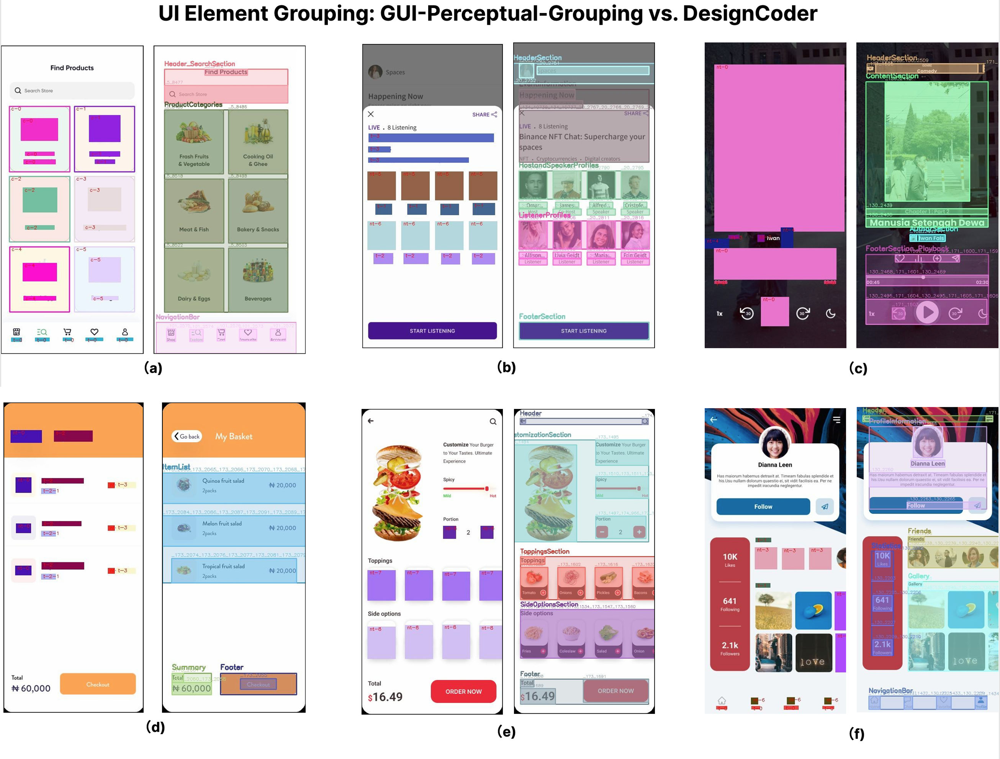

# DesignCoder

This repository provides the dataset, baseline implementations, and supplementary materials accompanying our paper to facilitate a deeper understanding of our approach. The complete source code of the proposed method will be released in future updates.

## What's Included

1. **Dataset**
   A new GUI dataset was constructed to address the lack of benchmark data for GUI-to-code generation tasks. It includes \~300 fully annotated GUI design files (in JSON format), corresponding screenshots, image assets, and the scripts used for data preprocessing and statistical analysis.
2. **Ground-Truth Code**
   For each page in the dataset, verified front-end code is provided for evaluation. These code samples were initially generated by CodeFun and subsequently refined by experienced developers to ensure correctness and quality.
3. **Baseline Implementations**
   We evaluated two core stages of our workflow using prior state-of-the-art methods (from FSE’25 and FSE’22) as baselines. Their implementations and representative comparison examples are included.
4. **Intermediate Outputs**
   To enhance transparency, we release selected intermediate results from our pipeline.

## Contents

```bash
.
├── dataset/                  # Dataset files and scripts
│   ├── GUI_dataset/          # Raw dataset files
│   ├── processing_script/    # Script for data preprocessing
│   ├── statistics_script/    # Script for dataset statistics
│   └── README.md             # Dataset introduction
│
├── code_groundtruth/         # Ground-truth code for evaluation
│   ├── code/                 # Verified React + CSS code for all UI pages
│   └── README.md             # Explanation of ground-truth generation
│
├── baselines/                # Baseline implementations and comparisons
│   ├── DCGen/                # Baselines from FSE’25
│   ├── GUI-Perceptual-Grouping/   # Baselines from FSE’22
│   └── README.md             # Details of baseline setups and examples
│
├── intermediate_outputs/     # Selected intermediate outputs from our pipeline
└── README.md                 # Overall introduction
```

## Figures

**Figure 1** compares UI segmentation results between DCGen \[1] (left) and DesignCoder (right). The colored outlines represent different segmentation regions identified by each method. DCGen’s pixel-based approach often fragments functionally related elements, while DesignCoder’s semantic segmentation preserves component integrity and hierarchical structure.


**Figure 2** ([assets/figure3.pdf](assets/)) shows element grouping comparisons between GUI-Perceptual-Grouping \[2] and DesignCoder. Elements with the same color blocks belong to the same group. While GUI-Perceptual-Grouping relies on visual proximity and similarity principles, DesignCoder identifies functional relationships to create semantically meaningful groups that better align with component boundaries.


---

\[1] DCGen: \<reference to FSE’25 paper>
\[2] GUI-Perceptual-Grouping: \<reference to FSE’22 paper>
